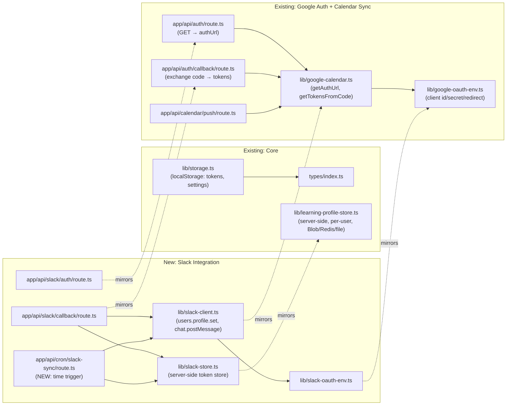

# Slack Integration — Planning Doc

Status: **planning only, no code written yet.**
Audience: developers picking this up, before touching any files.

---

## 1. What we're building and why

From product discussion: Slack integration should be **calendar/schedule-oriented**, not generic
chat-parsing. Chat-parsing (reading channel messages for deadlines) is a much harder, higher-risk
problem — closer to the syllabus-PDF parser than to Google Calendar sync — and is explicitly
**out of scope** for this plan. Everything here is **push-only**: Cadence tells Slack things: it
never reads channel content.

Four candidate features, ordered by build difficulty (easiest first):

| # | Feature | Direction | New infra needed |
|---|---|---|---|
| 1 | **Status sync** — set Slack status ("🎯 Focus block until 3pm") when a scheduled work session starts, clear it when it ends | Cadence → Slack | A time trigger (see §5 — this is the crux of the whole plan) |
| 2 | **Daily/weekly digest** — DM "3 things due this week" on a schedule | Cadence → Slack | Same time trigger as #1, reused |
| 3 | **Pre-session reminder** — DM 10–15 min before a scheduled block starts | Cadence → Slack | Same time trigger, finer-grained |
| 4 | **Slash command** (`/cadence today`, `/cadence add ...`) | Slack → Cadence | Slack request signing/verification, a new public endpoint class |

**Recommended MVP scope: build #1 (status sync) first.** It exercises the entire OAuth +
token-storage + time-trigger pipeline that #2 and #3 also need, with the smallest UI surface and
the fewest Slack permission scopes (`users.profile:write` only). #2 and #3 become "reuse the same
trigger, change what gets sent." #4 is architecturally different (inbound requests, not outbound)
and should be its own follow-up plan once #1–#3 are live.

---

## 2. Orient yourself in the codebase first

We already generated an Obsidian graph of this repo (workflow-grouped, not folder-grouped —
grouped by what code *does*). If you have that vault, open **`Google Auth + Calendar Sync.md`**
and **`Core Types & Storage.md`** — that's the cluster this plan extends. If you don't have the
vault, the relevant files and their real import relationships are:



The dotted "mirrors" edges are the point: **every new Slack file has a direct existing analog.**
Read the file it mirrors before writing the new one — don't design from scratch.

After this ships, regenerate the workflow vault and add an 11th group,
`"slack-integration"` (color e.g. `#4a154b`, Slack's own brand purple), containing every file
listed in §4.

---

## 3. The one architectural gap: **there is no time trigger in this codebase today**

This is the thing to understand before writing any code, because it changes the shape of the
whole feature.

Cadence is a Next.js app deployed on Vercel. All existing "background-ish" work
(`calendar-feed-store.ts`, `learning-profile-store.ts`) is **request-triggered**: it runs when a
user's browser hits an API route, not on a timer. There is no `vercel.json` cron config in this
repo (verified: not present) and no long-running server process (serverless functions don't stay
alive between requests).

Status sync needs to fire *when a scheduled block starts*, with nobody necessarily looking at the
app at that moment. Two real options:

**Option A — Vercel Cron (recommended).**
Add a `vercel.json` with a cron entry hitting `app/api/cron/slack-sync/route.ts` every 1–5
minutes. That route:
1. Loads every user who has Slack connected (needs an index — see §4, "who has Slack connected"
   problem).
2. For each, checks their scheduled events (already computed and stored — see `lib/storage.ts`
   `saveEvents`/`getEvents`, but **that's client-side localStorage**, not visible to a server cron
   job). This means status sync requires **server-side visibility into a user's schedule**, which
   today only exists for users who've enabled the ICS calendar feed (`lib/calendar-feed-store.ts`
   already syncs events server-side, keyed by feed token) or pushed to Google Calendar. **The
   calendar feed sync path is the one to reuse** — it's already the one place Cadence has a
   server-side copy of a user's schedule.
3. Compares "now" against each user's synced events; calls Slack's `users.profile.set` for
   sessions starting/ending in this tick.

**Option B — client-side timer while the app tab is open.**
`setInterval` in `app/app/page.tsx` checks upcoming events and calls a Cadence API route that
proxies to Slack. Simple, reuses nothing new, but **only works while the browser tab is open** —
defeats the point of a status sync (you want it to fire from your phone, tab closed, mid-class).

**Recommendation: Option A**, built on top of the existing calendar-feed sync path rather than
inventing a second server-side schedule store. Flag this as a design decision to confirm with the
team before starting — it's the one part of this plan that isn't just "mirror the Google pattern."

---

## 4. New files (mirroring the existing OAuth files 1:1)

| New file | Mirrors | Purpose |
|---|---|---|
| `lib/slack-oauth-env.ts` | `lib/google-oauth-env.ts` | `SLACK_CLIENT_ID` / `SLACK_CLIENT_SECRET` / `SLACK_REDIRECT_URI` env plumbing |
| `lib/slack-client.ts` | `lib/google-calendar.ts` (+ `google-calendar-rest.ts`) | `getSlackAuthUrl()`, `getSlackTokensFromCode()`, `setSlackStatus()`, `clearSlackStatus()` |
| `app/api/slack/auth/route.ts` | `app/api/auth/route.ts` | Returns Slack OAuth `authUrl` |
| `app/api/slack/callback/route.ts` | `app/api/auth/callback/route.ts` | Exchanges `code` for a token, redirects to `/app` |
| `lib/slack-store.ts` | `lib/learning-profile-store.ts` | **Server-side** token storage keyed by Cadence user identity (reuse the existing `googleSub`-keyed identity — see §4a), using the same Blob/Redis/file fallback chain |
| `app/api/cron/slack-sync/route.ts` | *(no existing analog — new)* | The Option-A cron target from §3 |
| `vercel.json` | *(new)* | Registers the cron schedule |
| `components/SlackConnectPanel.tsx` (or extend Settings) | `handleConnectGoogle`/`handleDisconnectGoogle` in `app/app/page.tsx` (~line 521, 556) | "Connect Slack" / "Disconnect" UI |

### 4a. Identity: reuse `googleSub`, don't invent a new user ID

`lib/learning-profile-store.ts` already keys server-side data by `googleSub` (the user's Google
identity — see `storage.saveGoogleIdentity`, `app/api/auth/callback/route.ts` lines ~33–41). Slack
tokens should be stored the same way: **keyed by the same `googleSub`**, not a new identifier.
This means:
- Slack connect should be gated behind "Google Calendar already connected" (or at minimum, behind
  having a `googleSub` identity), since that's Cadence's only durable cross-device user key today.
- `lib/slack-store.ts` takes the exact same shape as `learning-profile-store.ts`: `get(googleSub)`,
  `save(googleSub, data)`, same `DATA_DIR` / Blob-prefix / Redis-prefix pattern.

This is a real product constraint worth surfacing to the user, not just an implementation detail:
**Slack sync cannot work for a fully local/offline Cadence user** (no Google connected), because
there's no server-visible identity to key the cron job's Slack lookup off of.

### 4b. Data model additions (`types/index.ts`)

```ts
export interface SlackConnection {
  teamId: string;
  teamName?: string;
  accessToken: string;       // bot or user token, scoped to users.profile:write
  slackUserId: string;       // whose status we're allowed to set
  statusSyncEnabled: boolean;
  digestEnabled: boolean;
  reminderMinutesBefore?: number; // undefined = reminders off
}
```

Stored server-side via `lib/slack-store.ts` (§4), *not* in `lib/storage.ts`
localStorage — same reasoning as §4a.

### 4c. Settings UI touchpoints

Mirrors the existing Google Calendar section in the Settings dialog
(`app/app/page.tsx`, `settingsTab === 'calendar'` — same tab, new subsection below the existing
Google controls):
- "Connect Slack" button → `GET /api/slack/auth` → redirect, same shape as `handleConnectGoogle`.
- Once connected: toggles for **Status sync**, **Daily digest**, **Reminders (N min before)** —
  these map directly to the `SlackConnection` fields in §4b.
- "Disconnect" clears the stored `SlackConnection` server-side.

### 4d. i18n

New `m.settings.slack.*` keys mirroring the existing `m.feed.google*` keys
(`googleConnect`, `googleConnectHelp`, `googleReconnect`, `googleDisconnect`, etc. — see
`lib/i18n/messages/en.ts` around the `feed:` block). Needs both `en.ts` and `ko.ts` entries, same
as every prior feature in this repo.

---

## 5. Slack-side setup (what you do in Slack's developer console — separate from this repo)

1. Create a Slack App at api.slack.com/apps (needs a Slack account + a workspace; a free
   workspace is fine for development).
2. OAuth & Permissions → add redirect URL(s) — **same "one URL per deployment" constraint we hit
   with Google.** Register both the production callback and, if testing on a preview deployment,
   that preview's callback too.
3. Bot Token Scopes needed for MVP (#1, status sync): `users.profile:write`. For #2/#3 (digest,
   reminders) additionally: `chat:write` and `im:write` (DM the user).
4. Install the app to your dev workspace → gives you the Client ID/Secret to put in this repo's
   env (`SLACK_CLIENT_ID`, `SLACK_CLIENT_SECRET`, `SLACK_REDIRECT_URI`), same pattern as
   `.env.example`'s existing `GOOGLE_CLIENT_ID` block.

---

## 6. Testing plan

Mirror the existing test shape:
- `tests/slack-client.test.ts` — unit tests for the pure request-building logic in
  `lib/slack-client.ts`, same style as `tests/google-calendar-rest.test.ts`.
- `tests/slack-store.test.ts` — same style as any store test already in the suite (check
  `lib/learning-profile-store.ts` for whether it has a direct test; if not, this would be the
  first, and should still follow the local-file-backend path so it runs without real Blob/Redis
  credentials in CI).
- Cron route: test the "which events fall in this tick" windowing logic as a pure function,
  separate from the route handler, the same way `lib/ai-agent.ts`'s scheduling logic is
  unit-tested independent of `app/app/page.tsx`.

---

## 7. Open questions to resolve before coding

1. **Confirm Option A (Vercel Cron) vs. Option B (client-timer)** from §3 — this determines
   whether §4's cron route and `vercel.json` are needed at all, or whether this becomes a much
   smaller client-only feature with the "tab must stay open" limitation.
2. **Confirm the `googleSub`-gating constraint (§4a)** — is "must connect Google first" acceptable
   product-wise, or does Slack need to work standalone (which would require inventing a new
   identity system — much bigger scope)?
3. Bot token vs. user token: `users.profile:write` typically requires acting *as* the user (user
   token via `user_scope`), not a bot token — confirm during Slack app setup (§5.3), since it
   changes the OAuth install flow slightly (Slack distinguishes bot scopes from user scopes in the
   same app).
4. Rate limits: Slack's Web API has per-method rate limits; a cron job iterating many users every
   1–5 minutes should batch/throttle `users.profile.set` calls — worth a short spike once user
   volume is known, not a blocker for MVP with a handful of test users.

---

## 8. Suggested build order (once §7 is resolved)

1. `lib/slack-oauth-env.ts` + `lib/slack-client.ts` (OAuth URL + token exchange only — no Slack
   API calls yet). Unit-testable in isolation.
2. `app/api/slack/auth/route.ts` + `app/api/slack/callback/route.ts` + `lib/slack-store.ts`.
   At this point: "Connect Slack" works end to end, tokens are stored, nothing happens with them
   yet.
3. `lib/slack-client.ts`: add `setSlackStatus()` / `clearSlackStatus()`. Manually callable from a
   temporary debug route to confirm the Slack API call itself works before wiring automation.
4. `app/api/cron/slack-sync/route.ts` + `vercel.json`. This is where §3's design decision matters
   most — build against whatever server-visible schedule source was chosen.
5. Settings UI (§4c) + i18n (§4d) last, once the underlying plumbing is proven with curl/manual
   testing — same order this repo generally follows (logic first, UI wiring after, as seen with
   the syllabus feature).
